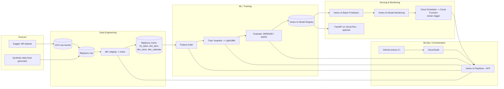

# Architecture

## Why these choices

- **One orchestrator, not two**: Vertex AI Pipelines (KFP) runs both the dbt
  transform step and the ML train/eval steps, instead of paying for Cloud
  Composer *and* Vertex AI separately. Pay-per-run, nothing idle.
- **Batch prediction as the primary serving path**: retail replenishment
  decisions are made on a daily/weekly cadence, not per-request — a scheduled
  batch job is both more realistic and far cheaper than an always-on
  endpoint. A Cloud Run API is an optional add-on to demonstrate real-time
  serving, not the main path.
- **Synthetic daily feed instead of Pub/Sub streaming**: M5 is a frozen
  historical dataset. Rather than standing up Pub/Sub + Dataflow (real cost,
  real complexity) just to simulate freshness, a scheduled script appends one
  new plausible day directly to BigQuery. Documented as swappable for a real
  streaming path later.
- **dbt for transforms**: staging views normalize raw types; mart tables
  (`fct_sales` + dimensions) are the single interface the ML feature step
  reads from, so model code never touches raw M5 quirks (wide date columns,
  per-state SNAP flags, etc.) directly.

See `ROADMAP.md` for what's implemented vs. planned, and
`infra/terraform/README.md` for cost notes on the GCP resources.
