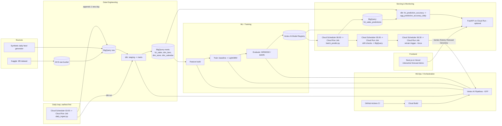

# Architecture

## Why these choices

- **One orchestrator, not two**: Vertex AI Pipelines (KFP) runs both the dbt
  transform step and the ML train/eval steps, instead of paying for Cloud
  Composer *and* Vertex AI separately. Pay-per-run, nothing idle.
- **Batch prediction as the primary serving path**: retail replenishment
  decisions are made on a daily/weekly cadence, not per-request — a scheduled
  batch job is both more realistic and far cheaper than an always-on
  endpoint. Implemented as a Cloud Run Job on a Cloud Scheduler trigger
  rather than a literal Vertex AI Batch Prediction resource: a raw LightGBM
  booster has no generic pre-built Vertex serving container, so a custom one
  would be needed either way, and a plain scheduled job querying BigQuery
  directly is simpler than wiring that container into Vertex's batch
  prediction API for the same result. A Cloud Run API (same serving image)
  is an optional add-on to demonstrate real-time serving, not the main path.
- **Synthetic daily feed instead of Pub/Sub streaming**: M5 is a frozen
  historical dataset. Rather than standing up Pub/Sub + Dataflow (real cost,
  real complexity) just to simulate freshness, a scheduled Cloud Run Job
  (`data_engineering/daily_ingest.py`) appends one new plausible day directly
  to BigQuery every day, ahead of drift-check/batch-predict/retrain-trigger
  in the schedule so they always see today's data. Documented as swappable
  for a real streaming path later.
- **Dates rebased to land near real time, not backfilled**: M5's history
  ends in 2016 - rather than fabricating ~10 years of catch-up data (100M+
  rows), every date is shifted by a fixed `date_offset_days` (applied in
  dbt's staging layer, chosen as a multiple of 7 to preserve day-of-week
  seasonality exactly) so the dataset's last real day lands on "yesterday".
  From there, `daily_ingest.py` only ever adds one new day per day, in the
  same *relative* time the raw tables were always in - the offset does the
  work of keeping it current, not a growing backfill.
- **Predictions and actuals as separate marts, joined once actuals land**:
  `batch_predict.py` writes to `fct_sales_predictions`; a separate dbt model
  (`fct_prediction_accuracy`) inner-joins it against `fct_sales` on
  `(date, store_id, item_id)` - a prediction simply doesn't appear in the
  accuracy marts until the next day's `daily_ingest.py` run lands that
  date's real sales, with no explicit "is this ready yet" check needed.
- **dbt for transforms**: staging views normalize raw types; mart tables
  (`fct_sales` + dimensions) are the single interface the ML feature step
  reads from, so model code never touches raw M5 quirks (wide date columns,
  per-state SNAP flags, etc.) directly.
- **Frontend on Vercel, not GCP**: the Next.js demo is stateless and has no
  reason to live on the same cloud as the ML backend — Vercel's free tier
  and zero-config Next.js deploys are simply the better fit, and the two
  sides only ever talk over a plain HTTP API (CORS-enabled), so the split
  costs nothing in complexity.

See `ROADMAP.md` for what's implemented vs. planned, and
`infra/terraform/README.md` for cost notes on the GCP resources.
